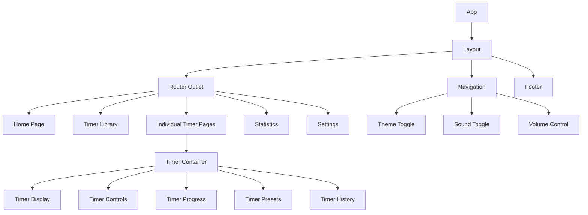

# Tunggu.in: Comprehensive Architecture & Implementation Plan

This document provides a complete technical architecture, implementation strategy, and project structure for the Tunggu.in timer SPA project.

---

## Table of Contents

1. [Project Overview](#1-project-overview)
2. [Tech Stack](#2-tech-stack)
3. [Project Structure](#3-project-structure)
4. [Component Architecture](#4-component-architecture)
5. [State Management Strategy](#5-state-management-strategy)
6. [Routing Architecture](#6-routing-architecture)
7. [PWA Implementation](#7-pwa-implementation)
8. [Data Persistence Strategy](#8-data-persistence-strategy)
9. [Theme System Architecture](#9-theme-system-architecture)
10. [Sound & Notification System](#10-sound--notification-system)
11. [Timer Categories & Features](#11-timer-categories--features)
12. [Deployment Strategy](#12-deployment-strategy)

---

## 1. Project Overview

Tunggu.in is a modern, themeable timer application built as a Single Page Application (SPA) with Progressive Web App (PWA) capabilities. The application provides various timer types for different use cases, from cooking to productivity, with beautiful animations and sound notifications.

### Core Principles

- **Offline-First**: Full functionality without internet connection
- **Performance**: Fast load times and smooth animations
- **Accessibility**: WCAG 2.1 AA compliant
- **Themeable**: Each timer has unique visual identity
- **Mobile-First**: Responsive design prioritizing mobile experience

---

## 2. Tech Stack

### Core Technologies

- **Frontend Framework:** React 18.3+
- **Build Tool:** Vite 5.x
- **Styling:** Tailwind CSS v4
- **State Management:** Zustand 4.x
- **UI Components:** shadcn/ui
- **Icons:** Lucide React
- **Routing:** React Router v6
- **Animations:** Framer Motion 11.x
- **Date/Time Handling:** date-fns 3.x

### Development Tools

- **TypeScript:** 5.x for type safety
- **ESLint:** Code quality
- **Prettier:** Code formatting
- **Vitest:** Unit testing
- **Playwright:** E2E testing

### Deployment & Analytics

- **Hosting:** Vercel
- **Analytics:** Vercel Analytics
- **Performance Monitoring:** Vercel Speed Insights

---

## 3. Project Structure

```
tunggu-in/
├── public/
│   ├── manifest.json
│   ├── icons/
│   │   ├── icon-72x72.png
│   │   ├── icon-96x96.png
│   │   ├── icon-128x128.png
│   │   ├── icon-144x144.png
│   │   ├── icon-152x152.png
│   │   ├── icon-192x192.png
│   │   ├── icon-384x384.png
│   │   └── icon-512x512.png
│   ├── sounds/
│   │   ├── kitchen/
│   │   │   ├── stove-click.mp3
│   │   │   ├── timer-tick.mp3
│   │   │   └── oven-ding.mp3
│   │   ├── fitness/
│   │   │   ├── beep-start.mp3
│   │   │   ├── beep-rest.mp3
│   │   │   └── workout-complete.mp3
│   │   ├── productivity/
│   │   │   ├── soft-click.mp3
│   │   │   └── notification-chime.mp3
│   │   └── games/
│   │       ├── game-start.mp3
│   │       ├── tick-fast.mp3
│   │       └── buzzer.mp3
│   └── offline.html
├── src/
│   ├── components/
│   │   ├── common/
│   │   │   ├── Layout.tsx
│   │   │   ├── Navigation.tsx
│   │   │   ├── Footer.tsx
│   │   │   ├── ThemeToggle.tsx
│   │   │   ├── SoundToggle.tsx
│   │   │   └── VolumeControl.tsx
│   │   ├── timer/
│   │   │   ├── TimerDisplay.tsx
│   │   │   ├── TimerControls.tsx
│   │   │   ├── TimerProgress.tsx
│   │   │   ├── TimerPresets.tsx
│   │   │   └── TimerHistory.tsx
│   │   ├── ui/
│   │   │   └── (shadcn components)
│   │   └── animations/
│   │       ├── FadeIn.tsx
│   │       ├── SlideIn.tsx
│   │       ├── Pulse.tsx
│   │       └── TimerAnimation.tsx
│   ├── pages/
│   │   ├── Home.tsx
│   │   ├── TimerLibrary.tsx
│   │   ├── Statistics.tsx
│   │   ├── Settings.tsx
│   │   └── timers/
│   │       ├── kitchen/
│   │       │   ├── EggTimer.tsx
│   │       │   ├── SteakTimer.tsx
│   │       │   ├── CoffeeTimer.tsx
│   │       │   ├── TeaTimer.tsx
│   │       │   └── DoughProofing.tsx
│   │       ├── fitness/
│   │       │   ├── PomodoroTimer.tsx
│   │       │   ├── HIITTimer.tsx
│   │       │   ├── BoxBreathing.tsx
│   │       │   ├── MeditationTimer.tsx
│   │       │   └── PowerNap.tsx
│   │       ├── productivity/
│   │       │   ├── FiftyTwoSeventeen.tsx
│   │       │   ├── Stopwatch.tsx
│   │       │   ├── CountdownTimer.tsx
│   │       │   └── QuickBurst.tsx
│   │       └── games/
│   │           ├── BoardGameTimer.tsx
│   │           └── FiveSecondRule.tsx
│   ├── hooks/
│   │   ├── useTimer.ts
│   │   ├── useSound.ts
│   │   ├── useNotification.ts
│   │   ├── useTheme.ts
│   │   ├── useLocalStorage.ts
│   │   ├── useKeyboardShortcuts.ts
│   │   └── usePageVisibility.ts
│   ├── stores/
│   │   ├── timerStore.ts
│   │   ├── settingsStore.ts
│   │   ├── historyStore.ts
│   │   └── soundStore.ts
│   ├── services/
│   │   ├── storage.ts
│   │   ├── notification.ts
│   │   ├── sound.ts
│   │   ├── pwa.ts
│   │   └── analytics.ts
│   ├── utils/
│   │   ├── time.ts
│   │   ├── format.ts
│   │   ├── constants.ts
│   │   └── helpers.ts
│   ├── styles/
│   │   ├── globals.css
│   │   └── themes/
│   │       ├── kitchen.css
│   │       ├── fitness.css
│   │       ├── productivity.css
│   │       └── games.css
│   ├── types/
│   │   ├── timer.ts
│   │   ├── settings.ts
│   │   └── theme.ts
│   ├── App.tsx
│   ├── main.tsx
│   └── vite-env.d.ts
├── .env.example
├── .eslintrc.cjs
├── .gitignore
├── .prettierrc
├── index.html
├── package.json
├── postcss.config.js
├── tailwind.config.js
├── tsconfig.json
├── tsconfig.node.json
├── vercel.json
├── vite.config.ts
└── vitest.config.ts
```

---

## 4. Component Architecture

### Component Hierarchy



### Key Component Patterns

#### 1. Timer Container Pattern

```typescript
interface TimerContainerProps {
  timerConfig: TimerConfig;
  theme: TimerTheme;
  children?: React.ReactNode;
}
```

#### 2. Composable Timer Components

- **TimerDisplay**: Shows current time with themed styling
- **TimerControls**: Start/pause/reset buttons with animations
- **TimerProgress**: Visual progress indicator (circular/linear)
- **TimerPresets**: Quick-select common durations
- **TimerHistory**: Recent timer sessions

#### 3. Animation Wrappers

- **FadeIn**: Entrance animations
- **SlideIn**: Panel transitions
- **Pulse**: Active timer indicators
- **TimerAnimation**: Timer-specific animations

---

## 5. State Management Strategy

### Zustand Store Architecture

```typescript
// Core Timer Store
interface TimerStore {
  // State
  timers: Map<string, Timer>;
  activeTimerId: string | null;

  // Actions
  createTimer: (config: TimerConfig) => string;
  startTimer: (id: string) => void;
  pauseTimer: (id: string) => void;
  resetTimer: (id: string) => void;
  deleteTimer: (id: string) => void;

  // Selectors
  getTimer: (id: string) => Timer | undefined;
  getActiveTimer: () => Timer | undefined;
}

// Settings Store
interface SettingsStore {
  // State
  theme: "light" | "dark" | "system";
  soundEnabled: boolean;
  volume: number;
  notificationsEnabled: boolean;
  vibrationEnabled: boolean;

  // Actions
  updateSettings: (settings: Partial<Settings>) => void;
  resetSettings: () => void;
}

// History Store
interface HistoryStore {
  // State
  sessions: TimerSession[];
  statistics: Statistics;

  // Actions
  addSession: (session: TimerSession) => void;
  clearHistory: () => void;

  // Selectors
  getSessionsByType: (type: TimerType) => TimerSession[];
  getStatistics: (timeRange?: TimeRange) => Statistics;
}
```

### Store Persistence

- Timer state: Session storage (cleared on close)
- Settings: Local storage (persistent)
- History: IndexedDB (for large datasets)

---

## 6. Routing Architecture

### Route Structure

```typescript
const routes = [
  {
    path: "/",
    element: <Home />,
  },
  {
    path: "/timers",
    element: <TimerLibrary />,
  },
  {
    path: "/statistics",
    element: <Statistics />,
  },
  {
    path: "/settings",
    element: <Settings />,
  },
  // Kitchen Timers
  {
    path: "/egg-timer",
    element: <EggTimer />,
  },
  {
    path: "/steak-timer",
    element: <SteakTimer />,
  },
  {
    path: "/coffee-timer",
    element: <CoffeeTimer />,
  },
  // Fitness Timers
  {
    path: "/pomodoro",
    element: <PomodoroTimer />,
  },
  {
    path: "/hiit",
    element: <HIITTimer />,
  },
  // ... other timer routes
];
```

### Deep Linking Support

- Timer state in URL: `/pomodoro?duration=25&break=5`
- Shareable links with presets
- Browser back/forward navigation support

---

## 7. PWA Implementation

### Service Worker Strategy

```javascript
// sw.js - Workbox configuration
import { precacheAndRoute } from "workbox-precaching";
import { registerRoute } from "workbox-routing";
import { StaleWhileRevalidate, CacheFirst } from "workbox-strategies";

// Precache all static assets
precacheAndRoute(self.__WB_MANIFEST);

// Cache API responses
registerRoute(
  ({ url }) => url.pathname.startsWith("/api/"),
  new StaleWhileRevalidate({
    cacheName: "api-cache",
  })
);

// Cache images and sounds
registerRoute(
  ({ request }) =>
    request.destination === "image" || request.destination === "audio",
  new CacheFirst({
    cacheName: "media-cache",
    plugins: [
      new ExpirationPlugin({
        maxEntries: 60,
        maxAgeSeconds: 30 * 24 * 60 * 60, // 30 days
      }),
    ],
  })
);
```

### Offline Functionality

- All timer logic runs client-side
- Cached assets for offline use
- Offline page fallback
- Background sync for statistics

### Installation Prompt

```typescript
const useInstallPrompt = () => {
  const [deferredPrompt, setDeferredPrompt] = useState(null);

  useEffect(() => {
    window.addEventListener("beforeinstallprompt", (e) => {
      e.preventDefault();
      setDeferredPrompt(e);
    });
  }, []);

  const install = async () => {
    if (deferredPrompt) {
      deferredPrompt.prompt();
      const { outcome } = await deferredPrompt.userChoice;
      setDeferredPrompt(null);
    }
  };

  return { canInstall: !!deferredPrompt, install };
};
```

---

## 8. Data Persistence Strategy

### Local Storage Schema

```typescript
// Settings
interface StoredSettings {
  theme: "light" | "dark" | "system";
  soundEnabled: boolean;
  volume: number;
  notificationsEnabled: boolean;
  vibrationEnabled: boolean;
  defaultTimerSettings: Record<TimerType, TimerPreset>;
}

// Custom Timers
interface StoredCustomTimer {
  id: string;
  name: string;
  stages: TimerStage[];
  theme: TimerTheme;
  sound: SoundPreset;
  createdAt: number;
  lastUsed: number;
}

// History (IndexedDB)
interface TimerSession {
  id: string;
  timerType: TimerType;
  duration: number;
  completedAt: number;
  wasCompleted: boolean;
  stages?: StageCompletion[];
}
```

### Storage Service

```typescript
class StorageService {
  // Local Storage
  static getSettings(): StoredSettings {
    const stored = localStorage.getItem("tunggu-settings");
    return stored ? JSON.parse(stored) : DEFAULT_SETTINGS;
  }

  static saveSettings(settings: StoredSettings): void {
    localStorage.setItem("tunggu-settings", JSON.stringify(settings));
  }

  // IndexedDB for history
  static async saveSession(session: TimerSession): Promise<void> {
    const db = await this.openDB();
    const tx = db.transaction("sessions", "readwrite");
    await tx.objectStore("sessions").add(session);
  }

  static async getRecentSessions(limit = 50): Promise<TimerSession[]> {
    const db = await this.openDB();
    const sessions = await db
      .transaction("sessions")
      .objectStore("sessions")
      .index("completedAt")
      .getAll(null, limit);
    return sessions.reverse();
  }
}
```

---

## 9. Theme System Architecture

### Theme Structure

```typescript
interface TimerTheme {
  id: string;
  name: string;
  category: TimerCategory;
  colors: {
    primary: string;
    secondary: string;
    background: string;
    surface: string;
    text: string;
    accent: string;
  };
  animations: {
    timerPulse?: boolean;
    progressStyle: "circular" | "linear" | "dots";
    completionAnimation: string;
  };
  sounds: {
    start: string;
    tick?: string;
    warning?: string;
    complete: string;
  };
}
```

### CSS Variables System

```css
/* Base theme variables */
:root {
  --color-primary: theme("colors.blue.500");
  --color-secondary: theme("colors.gray.600");
  --color-background: theme("colors.white");
  --color-surface: theme("colors.gray.50");
  --color-text: theme("colors.gray.900");
  --color-accent: theme("colors.blue.400");
}

/* Dark mode */
.dark {
  --color-primary: theme("colors.blue.400");
  --color-secondary: theme("colors.gray.400");
  --color-background: theme("colors.gray.900");
  --color-surface: theme("colors.gray.800");
  --color-text: theme("colors.gray.100");
  --color-accent: theme("colors.blue.300");
}

/* Timer-specific themes */
.theme-kitchen {
  --color-primary: theme("colors.orange.500");
  --color-accent: theme("colors.amber.400");
  /* ... */
}

.theme-fitness {
  --color-primary: theme("colors.green.500");
  --color-accent: theme("colors.emerald.400");
  /* ... */
}
```

### Dynamic Theme Loading

```typescript
const useTimerTheme = (timerType: TimerType) => {
  useEffect(() => {
    const theme = TIMER_THEMES[timerType];
    document.documentElement.setAttribute("data-timer-theme", theme.id);

    return () => {
      document.documentElement.removeAttribute("data-timer-theme");
    };
  }, [timerType]);
};
```

---

## 10. Sound & Notification System

### Sound Architecture

```typescript
class SoundManager {
  private sounds: Map<string, HTMLAudioElement> = new Map();
  private context: AudioContext;

  async preloadSound(id: string, url: string): Promise<void> {
    const audio = new Audio(url);
    audio.preload = "auto";
    this.sounds.set(id, audio);
  }

  async play(id: string, volume: number = 1): Promise<void> {
    const audio = this.sounds.get(id);
    if (audio) {
      audio.volume = volume;
      await audio.play();
    }
  }

  setMasterVolume(volume: number): void {
    this.sounds.forEach((audio) => {
      audio.volume = volume;
    });
  }
}
```

### Notification System

```typescript
class NotificationService {
  static async requestPermission(): Promise<boolean> {
    if (!("Notification" in window)) return false;

    const permission = await Notification.requestPermission();
    return permission === "granted";
  }

  static async notify(options: NotificationOptions): Promise<void> {
    if (Notification.permission === "granted") {
      const notification = new Notification("Tunggu.in", {
        icon: "/icons/icon-192x192.png",
        badge: "/icons/icon-72x72.png",
        vibrate: [200, 100, 200],
        ...options,
      });

      notification.onclick = () => {
        window.focus();
        notification.close();
      };
    }
  }
}
```

### Tab Title Updates

```typescript
const useTabTitle = (timer: Timer) => {
  useEffect(() => {
    if (timer.isRunning) {
      const interval = setInterval(() => {
        const remaining = formatTime(timer.remaining);
        document.title = `${remaining} - Tunggu.in`;
      }, 1000);

      return () => {
        clearInterval(interval);
        document.title = "Tunggu.in";
      };
    }
  }, [timer.isRunning, timer.remaining]);
};
```

---

## 11. Timer Categories & Features

### 🍳 Kitchen & Cooking

#### Timers

1. **Egg Timer**

   - Presets: Soft (4min), Medium (7min), Hard (10min)
   - Custom altitude adjustment
   - Visual egg animation

2. **Steak Timer**

   - Thickness input (0.5" - 3")
   - Doneness selection
   - Flip reminder at halfway

3. **Coffee Timer**

   - Methods: Pour Over, French Press, AeroPress, Cold Brew
   - Step-by-step instructions
   - Water temperature reminder

4. **Tea Timer**

   - Tea types: Green, Black, White, Oolong, Herbal
   - Steep time recommendations
   - Multiple infusion support

5. **Dough Proofing**
   - Long duration support (up to 48 hours)
   - Temperature notes
   - Rise percentage tracker

### 💪 Health & Fitness

#### Timers

1. **Pomodoro Timer**

   - Classic 25/5 intervals
   - Customizable work/break durations
   - Session counter
   - Daily goal tracking

2. **HIIT/Tabata Timer**

   - Work/rest interval customization
   - Round counter
   - Audio cues for transitions
   - Exercise name display

3. **Box Breathing**

   - 4-4-4-4 pattern
   - Visual breathing guide
   - Customizable breath holds
   - Calming animations

4. **Meditation Timer**

   - Ambient sounds
   - Interval bells
   - Session logging
   - Mindfulness quotes

5. **Power Nap Timer**
   - 20-minute default
   - Gentle wake sounds
   - Sleep cycle information

### 💡 Productivity & Study

#### Timers

1. **52/17 Timer**

   - DeskTime productivity method
   - Auto-start next session
   - Productivity tracking

2. **Stopwatch**

   - Lap functionality
   - Split times
   - Export to CSV

3. **Countdown Timer**

   - Date/time picker
   - Event naming
   - Share countdown link

4. **Quick Burst Timer**
   - 15-minute focused work
   - Task naming
   - Completion streak

### 🎲 Fun & Games

#### Timers

1. **Board Game Timer**

   - Player turn tracking
   - Tap to switch
   - Time bank option
   - Player names

2. **Five Second Rule**
   - 5-second countdown
   - Question prompts
   - Score tracking

---

## 12. Deployment Strategy

### Vercel Configuration

```json
// vercel.json
{
  "buildCommand": "npm run build",
  "outputDirectory": "dist",
  "framework": "vite",
  "rewrites": [
    {
      "source": "/(.*)",
      "destination": "/index.html"
    }
  ],
  "headers": [
    {
      "source": "/sw.js",
      "headers": [
        {
          "key": "Cache-Control",
          "value": "public, max-age=0, must-revalidate"
        }
      ]
    },
    {
      "source": "/(.*)",
      "headers": [
        {
          "key": "X-Content-Type-Options",
          "value": "nosniff"
        },
        {
          "key": "X-Frame-Options",
          "value": "DENY"
        },
        {
          "key": "X-XSS-Protection",
          "value": "1; mode=block"
        }
      ]
    }
  ]
}
```

### Environment Variables

```bash
# .env.example
VITE_APP_URL=https://tunggu.in
VITE_ANALYTICS_ID=your-vercel-analytics-id
VITE_SENTRY_DSN=your-sentry-dsn
```

### Build Optimization

```typescript
// vite.config.ts
import { defineConfig } from "vite";
import react from "@vitejs/plugin-react";
import { VitePWA } from "vite-plugin-pwa";

export default defineConfig({
  plugins: [
    react(),
    VitePWA({
      registerType: "autoUpdate",
      includeAssets: ["favicon.ico", "apple-touch-icon.png", "masked-icon.svg"],
      manifest: {
        name: "Tunggu.in - Beautiful Timers",
        short_name: "Tunggu.in",
        description: "A collection of beautiful, purposeful timers",
        theme_color: "#ffffff",
        icons: [
          {
            src: "icon-192x192.png",
            sizes: "192x192",
            type: "image/png",
          },
          {
            src: "icon-512x512.png",
            sizes: "512x512",
            type: "image/png",
          },
        ],
      },
    }),
  ],
  build: {
    rollupOptions: {
      output: {
        manualChunks: {
          "react-vendor": ["react", "react-dom", "react-router-dom"],
          "ui-vendor": ["framer-motion", "lucide-react"],
          "utils-vendor": ["date-fns", "zustand"],
        },
      },
    },
  },
});
```

### Performance Targets

- Lighthouse Score: 95+ across all metrics
- First Contentful Paint: < 1.5s
- Time to Interactive: < 3.5s
- Bundle size: < 200KB (gzipped)

### Monitoring & Analytics

- Vercel Analytics for user metrics
- Vercel Speed Insights for performance
- Error tracking with Sentry
- Custom event tracking for timer usage

---

## Implementation Phases

### Phase 1: Foundation (Week 1-2)

- Project setup with Vite + React + TypeScript
- Basic routing structure
- Core timer hook implementation
- Zustand store setup
- Basic UI components with shadcn/ui

### Phase 2: Timer Implementation (Week 3-4)

- Implement all timer types
- Timer-specific themes
- Sound system integration
- Local storage persistence

### Phase 3: PWA & Polish (Week 5)

- Service worker implementation
- Offline functionality
- Notifications
- Performance optimization
- Animations with Framer Motion

### Phase 4: Testing & Deployment (Week 6)

- Unit tests with Vitest
- E2E tests with Playwright
- Performance testing
- Vercel deployment
- Analytics integration

---

This comprehensive plan provides a solid foundation for building the Tunggu.in timer application with all requested features and architectural considerations.
